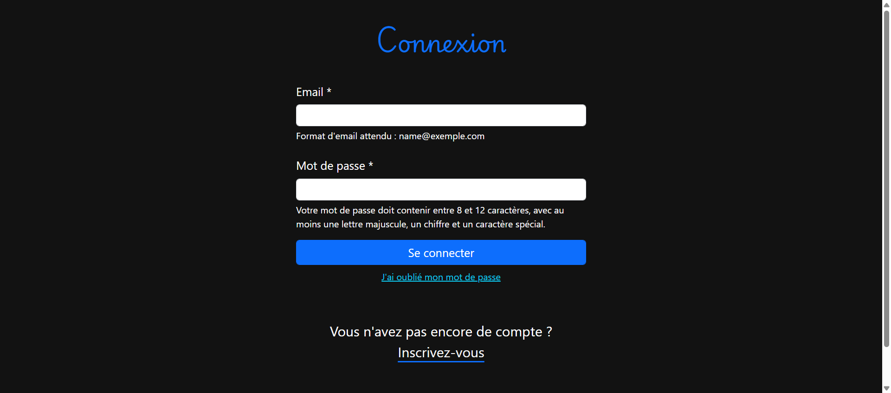
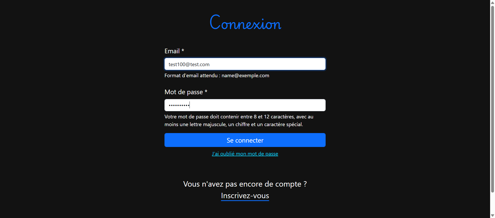
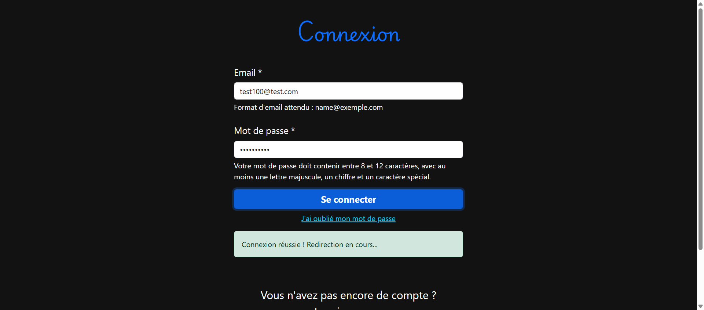
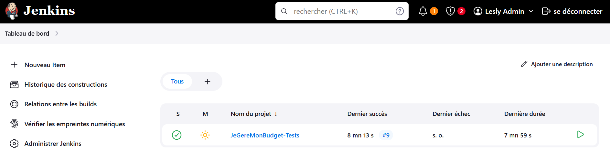
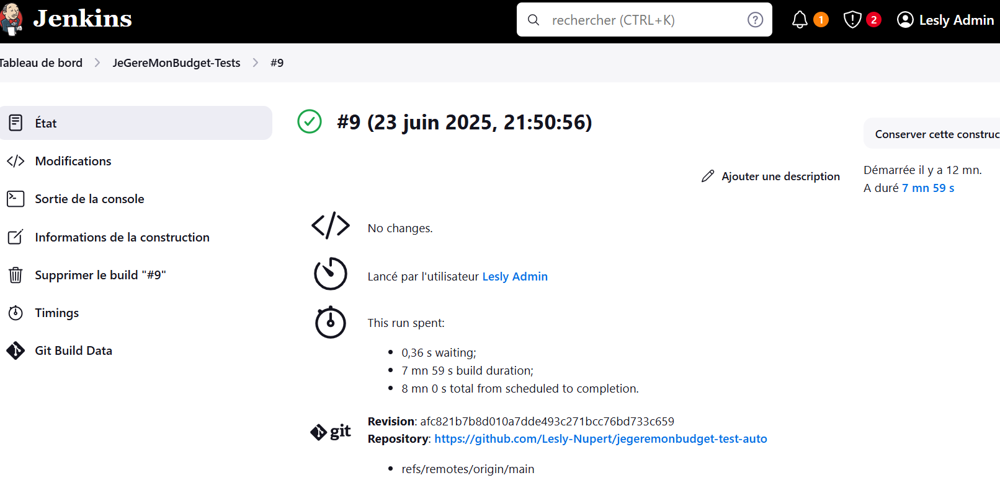
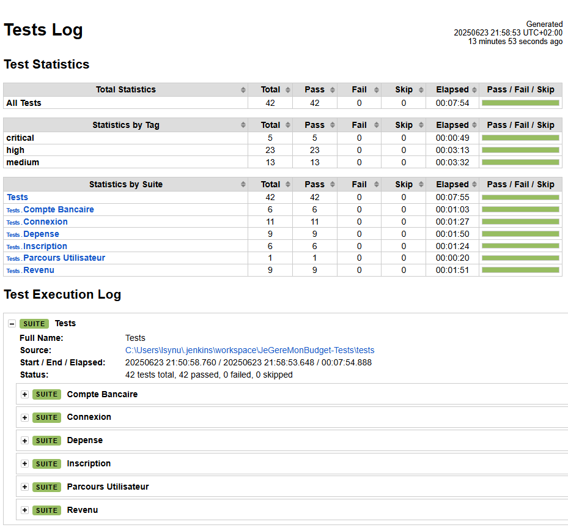

# JeGereMonBudget - Tests Automatisés 🤖

## 📊 Vue d'ensemble

Portfolio de tests automatisés développé pour l'application web [JeGereMonBudget](https://jegeremonbudget.netlify.app), une application de gestion de budget personnel permettant de suivre ses revenus et dépenses.

**🎯 Objectif :** Démontrer mes compétences en automatisation de tests avec une approche professionnelle incluant CI/CD.

### 📈 Métriques du projet
- **42 tests automatisés** couvrant 5 modules fonctionnels
- **100% de réussite** sur le pipeline Jenkins
- **2 approches** : Tests classiques + Template data-driven
- **Architecture modulaire** chaque fonctionnalité  dans son propre fichier

---

## 🏗️ Architecture du projet

```
JEGEREMONBUDGET-TEST-AUTO/
├── 📁 tests/
│   ├── inscription.robot              ← Tests classiques (6 tests)
│   ├── connexion.robot                ← Tests template (11 tests)
│   ├── compte_bancaire.robot          ← Tests classiques (6 tests)
│   ├── revenu.robot                   ← Tests classiques (9 tests)
│   ├── depense.robot                  ← Tests classiques (10 tests)
│   └── parcours_utilisateur.robot     ← Test E2E bout-en-bout
├── 📁 resources/
│   ├── commun.resource                ← Setup/Teardown & keywords partagés
│   ├── inscription.resource           ← Keywords spécifiques inscription
│   ├── connexion.resource             ← Keywords spécifiques connexion
│   ├── compte_bancaire.resource       ← Keywords spécifiques comptes bancaires
│   ├── revenu.resource                ← Keywords spécifiques revenus
│   └── depense.resource               ← Keywords spécifiques dépenses
└── 📁 results/                        
    ├── log.html                       ← Rapport technique détaillé
    ├── report.html                    ← Rapport de synthèse
    ├── output.xml                     ← Données brutes
    └── selenium-screenshot-*.png
├── .gitignore
├── README.md    

```
## Structure des fichiers

### commun.resource (ressources communes)
```robot
*** Settings ***        # Configuration et imports
*** Variables ***       # Variables globales (locators, données)
*** Keywords ***        # Setup/Teardown et keywords communs
```

### Fichier.resource (ressources réutilisables)
```robot
*** Settings ***        # Configuration et imports
*** Variables ***       # Variables globales (locators, données - messages applicatifs)
*** Keywords ***        # Keywords personnalisés
```
### Fichier.robot (tests)
```robot
*** Settings ***        # Configuration, imports, setup/teardown
*** Variables ***       # Variables spécifiques aux tests
*** Test Cases ***      # Les tests à exécuter
*** Keywords ***        # Keywords spécifiques à ce fichier - optionnel (utilisé dans le Template Connexion)
```
### Supports
- **[Documentation Robot Framework](https://docs.robotframework.org/docs/examples/project_structure)**
- **[Documentation SeleniumLibrary](https://robotframework.org/SeleniumLibrary/SeleniumLibrary.html#library-documentation-top)**
- **[Documentation BuilIn](https://robotframework.org/robotframework/latest/libraries/BuiltIn.html#Sleep)**


## 🚀 Technologies utilisées

| Technologie | Usage |
|-------------|-------|
| **Robot Framework** | Framework d'automatisation de tests |
| **SeleniumLibrary** | Pilotage navigateur web |
| **Python** | Langage support Robot Framework |
| **Jenkins** | Pipeline CI/CD et rapports |
| **Chrome** | Navigateur de test |
| **Git/GitHub** | Versioning |

---
## 🔧 Plugin VSCode
- **Robot Framework Language Server** aide à trouver des mots-clés et à l'autocomplétion - coloration syntaxique

## 🔍 Stratégie de localisation
- **Locators** générés avec l'extension Chrome SelectorsHub  
- **Priorité** : ID > CSS > XPath

## 💻 Installation et exécution

### Prérequis
```bash
# Installer Python 
# Installer WebDriver pour Chrome
```

### Installation
```bash
# Cloner le repository
git clone https://github.com/Lesly-Nupert/jegeremonbudget-test-auto
cd jegeremonbudget-test-auto

# Installer les dépendances
pip install robotframework
pip install  --upgrade robotframework-seleniumlibrary
```

### Exécution des tests

```bash
# Lancer tous les tests
robot --outputdir results tests/

# Lancer par module
robot --outputdir results tests/inscription.robot
robot --outputdir results tests/connexion.robot
robot --outputdir results tests/compte_bancaire.robot
robot --outputdir results tests/revenu.robot
robot --outputdir results tests/depense.robot
robot --outputdir results tests/parcours_utilisateur.robot

# Lancer par criticité
robot --include critical --outputdir results tests/
robot --include high --outputdir results tests/
robot --include medium --outputdir results tests/

# Infos
robot --outputdir results  # Dossier de sortie
robot --include tag       # Filtrer par tags
```

## 🤖 Pipeline Jenkins

**Configuration actuelle :**
* **Déclenchement** : Manuel via interface Jenkins
* **Environnement** : Local (java -jar jenkins.war)
* **Tests** : 42 tests automatisés en 8 minutes

**En production :**
* **Déclenchement** : Automatique sur push branche main
* **Intégration** : Git → Jenkins → Tests → Rapports


## 📈 Rapports et métriques

### Types de rapports générés
- **log.html** : Rapport technique détaillé avec screenshots
- **report.html** : Rapport avec métriques globales  
- **output.xml** : Fichier technique pour intégrations

### Métriques de qualité
- **Couverture fonctionnelle** : 5 modules principaux
- **Types de tests** : Positif + Negatif
- **Gestion d'erreurs** : Messages applicatifs + Validations HTML natives


## 🏷️ Système de tags

### [Tags] avec 3 niveaux de criticité

- **Critical** : 5 tests - Fonctionnalités essentielles (Bloquant si échec)
- **High** : 23 tests - Validations importants (Non bloquant)
- **Medium** : 14 tests - Validations secondaires

## 💾 Reporting automatique
Les rapports affichent automatiquement :
- Taux de réussite/échec
- Statistiques par niveau de criticité  
- Indicateurs pour décisions Go/No-Go

## 🤔 Défis Techniques et Solutions
**1. Variable dynamique pour CI/CD**  
**Défi** : Besoin d'un email dynamique dans le module Inscription afin d'éviter le message d'erreur "Cet email existe déjà"  
**Solution** : Création du Keyword *"Générer Email Unique"* avec timestamp.

**2. Messages d'erreurs HTML natifs vs applicatifs**  
**Défi** : Les messages HTML natifs ne s'affichent pas dans le DOM - Ils n'ont donc pas de Locators.  
**Solution** : Utilisation du keyword *"Run Keyword And Return Status"* qui permet de ne pas faire échouer le test même si le message n'est pas visible - C'est le test qui fera la véritable vérification avec le keyword "Vérifier Formulaire Inscription Non Soumis"

**3. Élément visible mais non cliquable en Jenkins**  
**Défi** : ElementClickInterceptedException sur le menu burger.  
**Solution** : Utilisation de Javascript - *"Execute JavaScript"*

## 📸 Captures d'écran

### Tests en exécution
*[Screenshot de l'exécution des tests avec navigateur]*





### Pipeline Jenkins
*[Screenshot du dashboard Jenkins avec build réussi]*






### Rapports Robot Framework
*[Screenshot du rapport avec statistiques par tags]*




## 🎯 Conclusion

Ce portfolio démontre ma capacité à :

✅ **Concevoir** une architecture de tests maintenable  
✅ **Développer** des tests automatisés  
✅ **Implémenter** un pipeline CI/CD fonctionnel  
✅ **Organiser** les tests par criticité métier  
✅ **Générer** des rapports exploitables  

